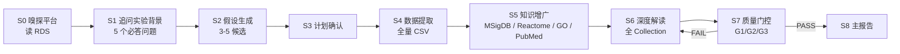
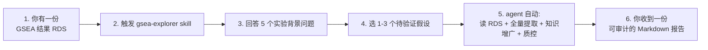
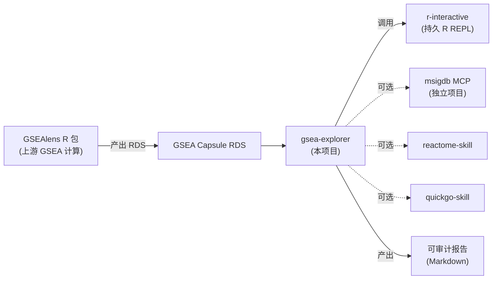
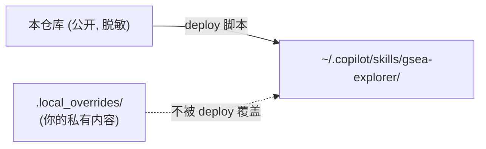

# gsea-explorer

> A stateful, question-driven exploratory analysis framework for GSEA enrichment results. Designed to be used as a Copilot skill or a standalone LLM-agent role definition.

[](LICENSE)
[](CHANGELOG.md)
[](CHANGELOG.md)
[](https://www.r-project.org/)
[](docs/architecture.md)

**简体中文** | [English](docs/README.en.md)

---

## 这是什么？

`gsea-explorer` 是一个**有状态、追问驱动**的 GSEA 富集结果探索框架。与"一次性把 CSV 丢给 LLM 解读"不同,它:

1. **在关键决策点停下来追问用户** — 造模方式、组织、分组动机、预期假设
2. **通过持久 R REPL** 持续读取 RDS,而不是 Rscript one-shot
3. **全量提取显著通路** — 移除 top-30 限制
4. **GSEAlens 式解读** — 用 |NES| 绝对值 + 富集方向 + 3 级置信度
5. **跨对比组联合分析** — ≥3 对比组强制做方向反转分类 (true_flip / p_suppression / p_restoration / ...)
6. **多组织 crosstalk** — 支持 4-6 治疗组 × 2+ 组织类型的联合分析
7. **审计一切** — 双格式 `audit.log` + `audit.jsonl`

## 状态机总览



完整状态合约见 [`gsea-explorer.agent.md`](gsea-explorer.agent.md)。

## 为什么不直接问 ChatGPT?

| 一次性 LLM | gsea-explorer |
|---|---|
| 凭通路名猜测机制 ("OXPHOS 上调") | **NES 方向严格从数据读** + 基因集名称结合 |
| 用 "inflammaging 七联征" 模板套所有衰老研究 | **禁止通用模板**, 必须引用用户的处理 + 组织 + CSV 行 |
| 单对比组独立总结 | **跨对比组联合分析**, 识别方向反转与涌现信号 |
| 无审计, 不知道 LLM 做了什么 | **每个决策落盘** `audit.log` + `audit.jsonl` |
| 用户不答实验背景也硬写 | **拒绝跳过 S1**, 没有背景就停下来追问 |

## 30 秒上手



### 输入支持的平台

| 平台 | 状态 | 测试覆盖 |
|---|---|---|
| [`gsealens`](https://github.com/DDL095/GSEAlens) Capsule | ✅ full | end-to-end validated |
| `clusterProfiler::gseaResult` | ⏸️ skeleton | profile 已定义, 待端到端测试 |
| `fgsea` data.frame | ⏸️ skeleton | profile 已定义, 待端到端测试 |
| `enrichit::gseaResult` | ⏸️ skeleton | profile 已定义, 待端到端测试 |

详见 [`profiles/`](profiles/) 目录。

## 安装

### 方式 A: 作为 Copilot Skill 使用 (推荐)

```powershell
# 1. clone 仓库
git clone https://github.com/DDL095/gsea-explorer.git D:\src\gsea-explorer

# 2. 运行 deploy 脚本 (Windows)
powershell -ExecutionPolicy Bypass -File D:\src\gsea-explorer\deploy\deploy_to_copilot.ps1

# 或 Linux/macOS
bash D:\src\gsea-explorer\deploy\deploy_to_copilot.sh
```

部署目标默认是 `$env:USERPROFILE\.copilot\skills\gsea-explorer\`(Windows)或
`~/.copilot/skills/gsea-explorer/`(Unix)。个人化的实验案例与本地路径可放在
`<target>/.local_overrides/`,deploy 脚本不会覆盖它。

### 方式 B: 作为独立 Agent 角色定义使用

把 [`gsea-explorer.agent.md`](gsea-explorer.agent.md) 复制到你的 agent 框架能加载的位置,
把 [`scripts/`](scripts/) 加入 `PATH` 或在 agent 配置中显式引用绝对路径即可。

## 目录结构

```
gsea-explorer/
├── SKILL.md                       主 skill 定义 (LLM 运行时读取)
├── gsea-explorer.agent.md         Agent 角色 / 阶段合约
├── gsea-explorer.md               紧凑角色概述
├── agents/                        子 agent 角色定义
├── scripts/                       R / Python / shell 辅助脚本
│   ├── sniff_platform.R             S0 平台嗅探
│   ├── extract_gsea_capsule.R       S4 全量提取
│   ├── audit_logger.py              双格式审计日志
│   ├── quality_gate_check.py        S7 G1/G2/G3 质控
│   ├── run_full_pipeline.ps1        Windows S0→S5 驱动
│   └── run_full_pipeline.sh         Unix S0→S8 驱动
├── profiles/                      每平台 schema 映射 (YAML)
├── references/                    NES 解读框架等参考材料
├── examples/                      合成数据上的示例走查
├── author_background_template.md  S1 用户填空模板
├── docs/                          架构、定制、路线图
├── tests/                         smoke + 回归测试
└── deploy/                        本地部署脚本
```

## 核心方法论速览

### |NES| 富集方向框架 (GSEAlens 风格)

| 级别 | 条件 | 含义 |
|---|---|---|
| **High** | \|NES\| ≥ 1.5 且 FDR < 0.05 | 可直接用于结论 |
| **Medium** | \|NES\| ≥ 1.0 且 FDR < 0.25 | 需交叉验证 |
| **Low** | 其他 | 仅供参考 |

- NES > 0 → 富集在 `left_group`
- NES < 0 → 富集在 `right_group`
- **NES 的符号只表示富集方向, 不表示基因表达变化方向**

完整规则(包括跨对比组方向反转分类、Markdown 转义、KEGG 名称误导防御)见
[`SKILL.md`](SKILL.md) §2 和 [`references/gsealens_nes_prompt.md`](references/gsealens_nes_prompt.md)。

### 跨对比组方向反转分类 (§2.1.4)

当有 ≥3 对比组时,同一通路在不同对比组中的 NES 方向变化被分类为 6 种模式:

| 模式 | 含义 | 典型场景 |
|---|---|---|
| `true_flip` | 符号真反转 | 上皮间充质转化 / 干细胞性 |
| `p_suppression` | 治疗压制了 baseline 富集 | IFN-γ / OXPHOS |
| `p_restoration` | 治疗重启了 baseline 下沉 | HYPOXIA / EMT |
| `rtp_only` / `rt_only` | 仅特定对比组显著 | 应激 / 免疫特异 |
| `no_flip` | 方向稳定 | — |

参考实现见 [`SKILL.md`](SKILL.md) §2.1.4 的 `classify_flip_mode()` 函数。

## 生态联动



> **注**: MSigDB MCP、Reactome、QuickGO 等外部 skill 都是**可选**的。
> gsea-explorer 核心只依赖 R + Python + LLM runtime。如果某个 MCP 不可用,
> 对应的知识增广步骤会优雅降级。

## 定制化与个人数据

公开仓库**不含**任何真实实验数据、个人路径或实验室标识。要把自己常用
的实验案例、本地路径、个性化模板引入到本地副本,请使用 `.local_overrides/`
机制:



详细用法见 [`docs/customization.md`](docs/customization.md)。

## 贡献

欢迎通过 PR 贡献。请先读 [`CONTRIBUTING.md`](CONTRIBUTING.md)。核心规则:

- 方法论变更必须同步更新 `SKILL.md` 与 `CHANGELOG.md`
- 新增 / 修改 platform profile 必须配套测试
- 任何文件**不得**包含真实 RDS 路径、实验标识或个人用户名

## 路线图

详见 [`docs/roadmap.md`](docs/roadmap.md)。近期重点:

- **v0.6**: clusterProfiler 一等公民化 + 测试套件 + 多 SA 并行架构 POC
- **v0.7**: MSigDB 解耦 (msigdbr R 包作核心, MCP 作可选增强) + 可视化代码落地
- **v1.0**: 测试覆盖 80%+ + 真实用户案例 + JOSS 投稿

## 引用

如果你在研究中使用 gsea-explorer,请按 [`CITATION.cff`](CITATION.cff) 引用。

## 许可证

[MIT](LICENSE) © 2026 DDL095
