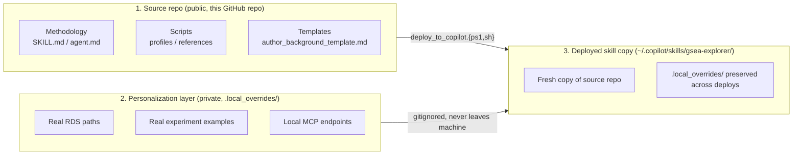

# Architecture

> How the public source repo, the local personalization layer, and the deployed skill copy fit together.

## Design goals

1. The GitHub repo must contain **only publishable content** — no real RDS paths, no lab dataset names, no usernames.
2. Local daily usage wants **personalization** — quick access to real experiment examples, local MSigDB database paths, lab-specific conventions.
3. The deployed skill copy (the one the agent runtime reads) must be **trivially refreshable** from the source repo without clobbering local personalization.

## The three-location model

### Location 1 — Source repo (public)

- What: this GitHub repository.
- Contents: methodology, scripts, platform profiles, references, examples, templates, docs, tests.
- Visibility: public MIT.
- Discipline: PR template enforces a "no personal data" checkbox; CI smoke test
  rejects any file containing Windows drive paths or known study-name patterns.

### Location 2 — Personalization layer (private)

- What: `<deploy_target>/.local_overrides/`.
- Contents: anything you do not want to share.
- Visibility: never committed (`.gitignore` excludes it).
- Typical files:
  - `local_paths.md` — absolute RDS paths on your machine
  - `real_examples/` — case studies using real data (for your own reference)
  - `msigdb_local.md` — pointer to your local MSigDB SQLite + MCP endpoint
- Lifetime: `deploy_to_copilot.ps1` explicitly skips this directory, so deploys
  never overwrite it.

### Location 3 — Deployed skill copy (private)

- What: `~/.copilot/skills/gsea-explorer/` (or wherever your Copilot install reads skills from).
- Contents: fresh copy of location 1 + preserved `.local_overrides/` from location 2.
- Refresh model: re-run `deploy_to_copilot.ps1` whenever you `git pull` the source repo.

## Why not just `git clone` into `.copilot/skills/`?

Tempting, but it causes three problems:

1. `.copilot/skills/` becomes a git working tree, so every `git pull` mixes
   upstream methodology changes with local experimentation.
2. Personal overrides end up tracked (or require constant `.gitignore` fighting).
3. CI tooling that scans `~/.copilot/skills/` may misinterpret `.git/` metadata.

The deploy-script model keeps the three concerns in three physically separate
locations.

## Deploy script contract

`deploy/deploy_to_copilot.{ps1,sh}` must:

1. **Copy** every tracked file from the source repo into the deploy target.
2. **Preserve** `<target>/.local_overrides/` — never overwrite, never delete.
3. **Not** copy `.git/`, `tests/testdata/*.rds`, or any `.local_overrides/`
   present in the source repo.
4. **Report** what changed (added / modified / removed) at the end of the run.
5. **Exit non-zero** on any copy error, without leaving the target in a partial state.

The script is idempotent: running it twice produces the same result.

## Decision log

| Date | Decision | Rationale |
|---|---|---|
| 2026-06-21 | Three-location model (source / override / deploy) | Keeps public repo clean while preserving personalization; avoids `.git` in `.copilot/skills/`. |
| 2026-06-21 | Personalization lives under `.local_overrides/` not in source tree | Prevents accidental commits of real paths; one gitignore rule covers it. |
| 2026-06-21 | Deploy via robocopy/rsync, not git subtree | Deploy target must stay a plain directory; git metadata would confuse skill scanners. |
