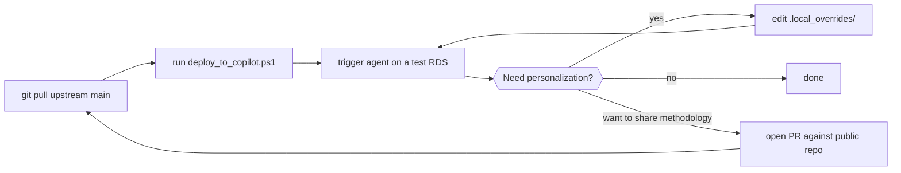

# Customization

> How to add personal paths, real experiment examples, and local MCP endpoints
> to your deployed copy of gsea-explorer without polluting the public repo.

## Mental model

The public repo teaches the agent **how to work**. Your local personalization
tells it **what to work on right now**. These two concerns are kept in separate
directories on purpose.

See [`architecture.md`](architecture.md) for the full three-location model.

## The `.local_overrides/` directory

After running the deploy script, your deployed skill copy looks like:

```
~/.copilot/skills/gsea-explorer/
├── SKILL.md                          (from public repo)
├── scripts/                          (from public repo)
├── profiles/                         (from public repo)
├── ...
└── .local_overrides/                 (private, never overwritten)
    ├── local_paths.md
    ├── msigdb_local.md
    └── real_examples/
        └── my_aging_mouse_study.md
```

Anything inside `.local_overrides/` is:

- ignored by the public repo's `.gitignore` (so it will never be committed)
- skipped by the deploy script (so it survives redeploys)
- readable by the agent as additional context (if you reference it from your
  prompt or from a local copy of `SKILL.md`)

## Suggested override files

### `local_paths.md`

A simple lookup table the agent can read when resolving RDS or database paths.

```markdown
# Local paths (this machine only)

| Resource | Path |
|---|---|
| GSEA Capsule directory | /mnt/d/my_lab/gsea_capsules/ |
| MSigDB SQLite | /mnt/d/my_lab/msigdb_scraper/msigdb.db |
| msigdb MCP CLI | /mnt/d/my_lab/msigdb_scraper/msigdb_query.py |
| R executable | <your_R_install>/bin/R.exe |
```

### `msigdb_local.md`

If you run a local MSigDB MCP (for the brief / full / PMID metadata needed by
the emergent discovery SOP in §3a of SKILL.md), document its endpoint here. The
public repo never assumes any particular MCP is available; when present, the
agent will prefer it over the fallback `msigdbr` R package.

### `real_examples/`

Drop case studies based on your real experiments here. They stay private. Use
them as reference material when you invoke the agent on similar future studies.
The public repo ships only synthetic-data examples under `examples/`.

## What belongs in the public repo instead

| Content | Public repo | `.local_overrides/` |
|---|---|---|
| NES interpretation framework | ✅ `SKILL.md` | — |
| Platform schema mappings | ✅ `profiles/*.yaml` | — |
| Extraction / audit / gate scripts | ✅ `scripts/` | — |
| Synthetic-data example walkthroughs | ✅ `examples/` | — |
| Author background questionnaire template | ✅ `author_background_template.md` | — |
| Your real RDS paths | ❌ | ✅ `local_paths.md` |
| Your real experiment case studies | ❌ | ✅ `real_examples/` |
| Your local MSigDB MCP endpoint | ❌ | ✅ `msigdb_local.md` |

If unsure, ask: *"Would a stranger on the internet benefit from this, or does
it only make sense on my machine?"* — answer determines the location.

## Workflow



## Safety checklist before redeploys

- [ ] `.local_overrides/` exists in the deploy target before running the deploy script
- [ ] No real paths have leaked into the public repo (`git grep -nE "^[A-Z]:\\\\" ` should return nothing)
- [ ] Deploy script reports "0 files removed" for the override directory
